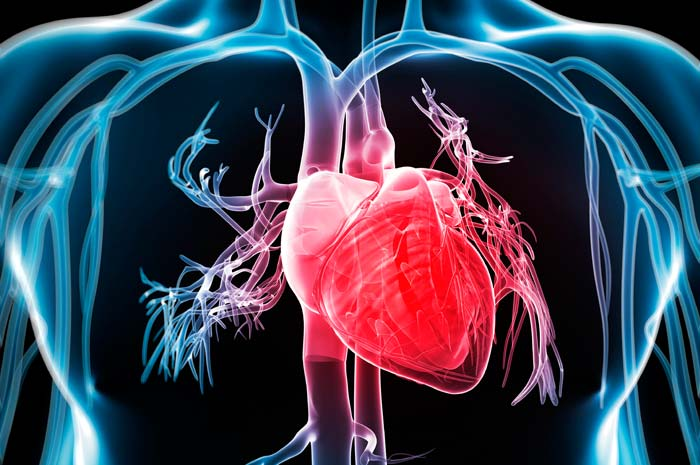

# 🏥 Analisi e Valutazione della Coronary Artery Disease (CAD)

## 📌 Descrizione del Progetto
Questo progetto mira a individuare il miglior modello predittivo per la malattia delle arterie coronarie (CAD) attraverso l'uso di tecniche di **machine learning**. L'analisi si concentra sulla selezione del modello con le migliori metriche di accuratezza e sulla sua interpretabilità mediante il metodo SHAP.

## 📂 Struttura del Progetto
- 📊 **`dataset/`**: Contiene i dati utilizzati per l'analisi.
- 🛠 **`scripts/`**: Include gli script R per la pulizia dei dati, l'analisi esplorativa e la modellazione.
- 📜 **`results/`**: Modelli ottenuti durante l'addestramento.
- 📖 **`README.md`**: Questo file, che fornisce informazioni dettagliate sul progetto.

## 📋 Requisiti
Per eseguire il progetto, assicurati di avere installati i seguenti pacchetti in R:
```r
install.packages(c("tidyverse", "randomForest", "xgboost", "caret", "shap", "ggplot2"))
```

## 🚀 Esecuzione del Progetto
1. **Clonare il repository**:
   ```sh
   git clone https://github.com/carmens0/Heart-disease-classification-R.git
   cd nome-repo
   ```


## 📊 Metodologia
1. **🔍 Analisi Esplorativa dei Dati (EDA)**: Esame delle variabili, test statistici e visualizzazioni.
2. **⚙️ Feature Engineering**: Selezione e trasformazione delle feature con **RFE (Recursive Feature Elimination)**.
3. **🧠 Modellazione**: Addestramento e confronto tra:
   - **Regressione Logistica**
   - **KNN (K-Nearest Neighbors)**
   - **Random Forest**
   - **Boosting (XGBoost)**
   - **Reti Neurali**
4. **📈 Interpretabilità**: Analisi con **SHAP (Shapley Additive Explanations)**.
5. **🔬 Confronto Modelli**: Analisi delle performance con metriche come **AUC, precision, recall e F1-score**.

## 📜 Risultati Principali
📌 Il miglior modello selezionato è stato **XGBoost**, che ha mostrato:
- **Accuratezza più elevata rispetto agli altri modelli**
- **Migliore capacità di generalizzazione**
- **Interpretabilità grazie a SHAP**

## 👩‍💻 Autore

## Author and contact 

| Name                | Description                                                                                       |
|---------------------|---------------------------------------------------------------------------------------------------|
| **Carmela Pia Senatore** | Developer - [carmens0](https://github.com/carmens0) <br> Email - [carmensenatore58@gmail.com](mailto:carmensenatore58@gmail.com) <br> LinkedIn - [Carmela Pia Senatore](https://linkedin.com/in/carmela-pia-senatore-ba1797207) |


